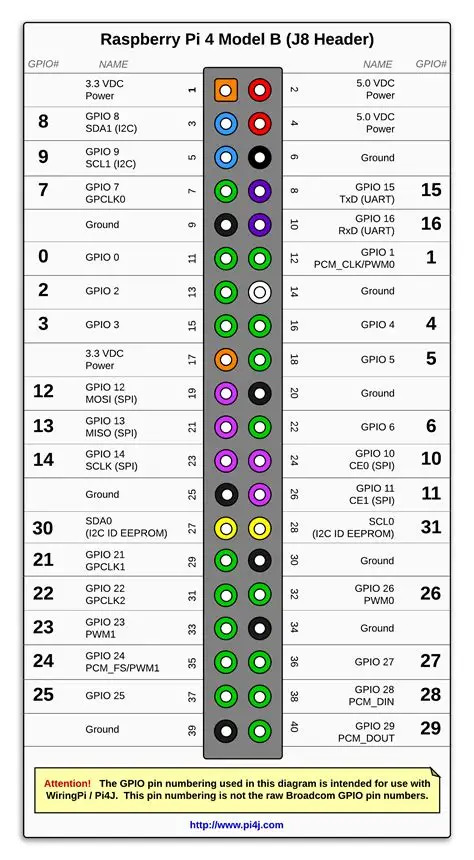

# 🔌 MX5-Telemetry Wiring Guide

Complete wiring reference for the MX5-Telemetry system.

---

## 🏎️ System Overview

```
┌────────────────────────────────────────────────────────────────────────────┐
│                           RASPBERRY PI 4B (Central Hub)                     │
│  GPIO 8/7 (CS) ─────► MCP2515 #1/#2     GPIO 14/15 ──► Arduino Serial      │
│  GPIO 10/9/11 (SPI) ─► Shared Bus       USB-A ───────► ESP32-S3 Display    │
│  GPIO 25/24 (INT) ──► Interrupts                                            │
└──────────────┬─────────────────┬────────────────────────────────────────────┘
               │                 │
    ┌──────────▼──────┐  ┌───────▼───────┐
    │  MCP2515 #1     │  │  MCP2515 #2   │
    │  HS-CAN 500k    │  │  MS-CAN 125k  │
    │  OBD Pin 6/14   │  │  OBD Pin 3/11 │
    └────────┬────────┘  └───────────────┘
             │ (parallel)
    ┌────────▼────────┐
    │  MCP2515 #3     │        ┌─────────────────────────────┐
    │  HS-CAN 500k    │        │        ARDUINO NANO         │
    │  OBD Pin 6/14   │◄──────►│  D10-13 (SPI) ◄─ MCP2515    │
    └─────────────────┘        │  D2 (INT) ◄──── MCP2515     │
                               │  D3/D4 ◄──────► Pi Serial   │
                               │  D5 ──────────► LED Strip   │
                               └─────────────────────────────┘
```

### Why 3 MCP2515 Modules?

SPI requires single-master operation. Each controller (Pi, Arduino) needs its own MCP2515 module with independent SPI. The CAN bus side (CANH/CANL) connects in parallel—CAN natively supports multiple listeners.

---

## ⚠️ Safety

- Disconnect vehicle battery for permanent connections
- Use 2A fuse on 12V lines
- Test voltages with multimeter before connecting devices
- Use heat shrink on all solder joints

---

## 📦 Components

| Component | Qty | Notes |
|-----------|-----|-------|
| Raspberry Pi 4B | 1 | 2GB+ RAM |
| ESP32-S3 Round Display | 1 | Waveshare 1.85" LCD |
| Arduino Nano V3.0 | 1 | ATmega328P |
| MCP2515 CAN Module | 3 | 8MHz crystal |
| WS2812B LED Strip | 1 | 20 LEDs |
| LM2596 Buck Converter | 1 | 12V→5V, 3A |
| OBD-II Extension Cable | 1 | For easy access |
| 2A Blade Fuse | 1 | 12V protection |

---

## 🔌 OBD-II Pinout

```
   OBD-II Female (looking at pins)
   ┌─────────────────────┐
   │  8  7  6  5  4  3  2  1 │
   │    16 15 14 13 12 11 10 9│
   └─────────────────────┘
```

| Pin | Signal | Connects To |
|-----|--------|-------------|
| 3 | MS-CAN High (125k) | MCP2515 #2 CANH |
| 5 | Ground | All devices |
| 6 | HS-CAN High (500k) | MCP2515 #1 + #3 CANH (spliced) |
| 11 | MS-CAN Low (125k) | MCP2515 #2 CANL |
| 14 | HS-CAN Low (500k) | MCP2515 #1 + #3 CANL (spliced) |
| 16 | 12V Battery | Buck converter + Pi power |

---

## 🥧 Raspberry Pi Wiring

> **Note**: This guide uses **BCM GPIO numbering** (Linux/Python standard), not WiringPi numbers.



### GPIO Reference (Physical Pin Layout)

```
        3.3V  (1) ●  ● (2)  5V
   BCM2/SDA1  (3) ●  ● (4)  5V
   BCM3/SCL1  (5) ●  ● (6)  GND ◄── MCP2515 GND
        BCM4  (7) ●  ● (8)  BCM14/TXD ──► Arduino D3 (RX)
         GND  (9) ●  ● (10) BCM15/RXD ◄── Arduino D4 (TX)
       BCM17 (11) ●  ● (12) BCM18
       BCM27 (13) ●  ● (14) GND
       BCM22 (15) ●  ● (16) BCM23
        3.3V (17) ●  ● (18) BCM24 ◄── MCP2515 #2 INT
  BCM10/MOSI (19) ●  ● (20) GND
   BCM9/MISO (21) ●  ● (22) BCM25 ◄── MCP2515 #1 INT
  BCM11/SCLK (23) ●  ● (24) BCM8/CE0 ◄── MCP2515 #1 CS
         GND (25) ●  ● (26) BCM7/CE1 ◄── MCP2515 #2 CS
       BCM0  (27) ●  ● (28) BCM1
       BCM5  (29) ●  ● (30) GND
       BCM6  (31) ●  ● (32) BCM12
      BCM13  (33) ●  ● (34) GND
      BCM19  (35) ●  ● (36) BCM16
      BCM26  (37) ●  ● (38) BCM20
         GND (39) ●  ● (40) BCM21
```

### MCP2515 → Pi Connections

| MCP2515 Pin | #1 (HS-CAN) | #2 (MS-CAN) |
|-------------|-------------|-------------|
| VCC | 3.3V ⚠️ | 3.3V ⚠️ |
| GND | Pin 6 | Pin 9 |
| CS | GPIO 8 (Pin 24) | GPIO 7 (Pin 26) |
| MOSI | GPIO 10 (Pin 19) | (shared) |
| MISO | GPIO 9 (Pin 21) | (shared) |
| SCK | GPIO 11 (Pin 23) | (shared) |
| INT | GPIO 25 (Pin 22) | GPIO 24 (Pin 18) |
| CANH | OBD Pin 6 | OBD Pin 3 |
| CANL | OBD Pin 14 | OBD Pin 11 |

⚠️ **Pi MCP2515 modules MUST use 3.3V** (not 5V)

### Other Pi Connections

| Connection | Pi | Device |
|------------|-----|--------|
| Serial TX | GPIO 14 (Pin 8) | Arduino D3 (RX) |
| Serial RX | GPIO 15 (Pin 10) | Arduino D4 (TX) |
| Serial GND | Pin 6 | Arduino GND |
| USB-A | Any USB port | ESP32-S3 USB-C |
| HDMI | Micro HDMI | Head unit |

---

## 🔵 Arduino Nano Wiring

### MCP2515 #3 → Arduino

| MCP2515 Pin | Arduino Pin | Notes |
|-------------|-------------|-------|
| VCC | 5V | From buck converter |
| GND | GND | Common ground |
| CS | D10 | |
| MOSI | D11 | |
| MISO | D12 | |
| SCK | D13 | |
| **INT** | **D2** | ⚠️ REQUIRED for interrupts |
| CANH | OBD Pin 6 | Parallel with Pi |
| CANL | OBD Pin 14 | Parallel with Pi |

### Other Arduino Connections

| Connection | Arduino Pin | Notes |
|------------|-------------|-------|
| LED Data | D5 | WS2812B DIN |
| Pi Serial RX | D3 | ← Pi GPIO 14 |
| Pi Serial TX | D4 | → Pi GPIO 15 (optional) |
| Brightness Pot | A6 | Optional |

### WS2812B LED Strip

| LED Pin | Connection |
|---------|------------|
| 5V | Buck converter OUT+ (not through Arduino) |
| GND | Common ground |
| DIN | Arduino D5 |

---

## 📺 ESP32-S3 Display

Single USB-C cable to Pi USB-A provides both power and serial (`/dev/ttyACM0`).

**Built-in features used**: 1.85" LCD, touch, IMU (G-force), BLE (TPMS)

---

## ⚡ Power Distribution

```
OBD Pin 16 (12V)
    ├──[2A Fuse]──► LM2596 ──► 5V: Arduino + LEDs + MCP2515 #3
    └──[3A Fuse]──► USB-C PD ──► Pi ──► ESP32 (via USB)

OBD Pin 5 (GND) ──► Common ground (all devices)
```

### LM2596 Setup
1. Connect 12V input, measure output with multimeter
2. Adjust to exactly **5.0V** before connecting anything
3. Output powers: Arduino 5V, MCP2515 #3 VCC, LED strip 5V

---

## ✅ Quick Checklist

### Power
- [ ] Buck converter adjusted to 5.0V
- [ ] 2A fuse on Arduino 12V line
- [ ] All grounds connected together

### Pi MCP2515s
- [ ] Both on 3.3V (not 5V!)
- [ ] INT pins connected (GPIO 25, 24)
- [ ] SPI shared, CS separate

### Arduino
- [ ] MCP2515 #3 INT → D2 (critical!)
- [ ] LED strip 5V direct from buck converter
- [ ] Common ground with Pi

### CAN Bus
- [ ] HS-CAN (pins 6/14) spliced to MCP2515 #1 + #3
- [ ] MS-CAN (pins 3/11) to MCP2515 #2 only

---

## 🧪 Testing

### Pi CAN Bus
```bash
ip link show can0 can1
sudo ip link set can0 up type can bitrate 500000
sudo ip link set can1 up type can bitrate 125000
candump can0  # Should see traffic with ignition ON
```

### ESP32 Serial
```bash
ls /dev/ttyACM*  # Should show device
```

### Arduino Serial
```bash
echo "SEQ:1" > /dev/serial0
```

---

## ❓ Troubleshooting

| Problem | Check |
|---------|-------|
| CAN interfaces missing | /boot/config.txt dtoverlay, wiring |
| MCP2515 probe fails | Voltage (3.3V Pi, 5V Arduino), SPI wires, INT pin |
| No CAN traffic | OBD pins, bitrate (500k HS, 125k MS), ignition ON |
| LEDs not working | 5V power, D5 connection, INT→D2 |
| ESP32 not detected | Different USB port, data-capable cable |
| Arduino serial fails | GPIO 14/15 wiring, common ground |

---

## 📁 Related Docs

- [PARTS_LIST.md](PARTS_LIST.md) - Full bill of materials
- [TPMS_BLUETOOTH.md](TPMS_BLUETOOTH.md) - BLE TPMS setup
- [../PI_DISPLAY_INTEGRATION.md](../PI_DISPLAY_INTEGRATION.md) - System architecture
