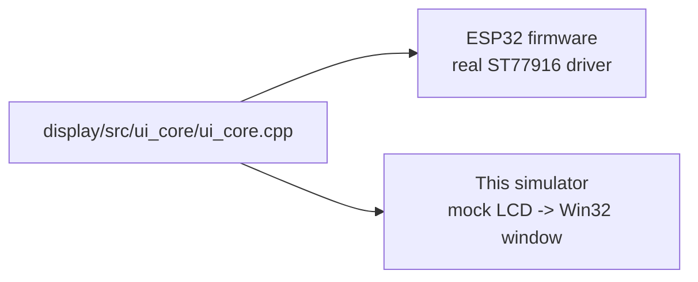

# Native ESP32-S3 Display Simulator

Runs the **actual** ESP32 UI code on Windows — no Python re-creation.

The simulator compiles `display/src/ui_core/ui_core.cpp` (the single source of
truth for the display UI, also compiled into the firmware) against a mock
`LCD_*` backend that draws into a 360x360 framebuffer and shows it in a Win32
window.



**Edit `display/src/ui_core/ui_core.cpp` and both the device and this simulator
change.** The only difference is the rendering backend.

## Requirements

- Windows + Visual Studio Build Tools (MSVC C++ workload). The build script
  locates it automatically via `vswhere`.

## Run

```bat
tools\simulators\native\run.bat         rem build + launch interactive window
tools\simulators\native\screenshot.bat  rem render every screen to shot_0..7.bmp
```

Or use the VS Code tasks **ESP32-S3 UI: Native Simulator (Run)** /
**(Screenshots)**.

## Controls

| Key | Action |
|-----|--------|
| Up / Down / Left / Right | previous / next screen |
| 1 – 8 | jump to screen (1 = Overview … 8 = Settings) |
| Enter | select / toggle the currently selected Settings item |
| + / - | RPM up / down |
| [ / ] | speed down / up |
| G | cycle gear (N, 1-6) |
| E | toggle engine running |
| C | toggle clutch |
| L | toggle navigation lock |
| H | print help |
| Esc | jump to Overview |
| Q | quit |

## How it stays in sync

The UI core is hardware-agnostic. All drawing goes through the `LCD_*` API:

- **On device:** `Display_ST77916.h` / `Display_ST77916.cpp` (real QSPI driver).
- **In the simulator:** `native_display.h` / `native_display.cpp` (mock that
  writes RGB888 into a framebuffer, with the same text metrics / font as the
  device).

`ui_core.h` picks the backend automatically:

```cpp
#ifdef UI_CORE_NATIVE
  #include "native_display.h"
#else
  #include "Display_ST77916.h"
#endif
```

## Files

```
tools/simulators/native/
  build.bat             locate MSVC + compile
  run.bat               build + launch interactive window
  screenshot.bat        build + render all screens to BMPs
  native_main.cpp       Win32 harness, keyboard input, demo telemetry
  native_display.cpp    mock LCD_* backend + 5x7 font + framebuffer
  native_display.h      mock LCD API
  native_platform.h     minimal Arduino shim (millis, constrain, Serial, ...)
```
